# Analise descritiva da base limpa

- Arquivo: `C:\Users\Administrator\Desktop\Ciencia de dados\data\processed\prf_limpo.csv`
- SHA-256: `0a028fe02ec748e115ab5e4d0d4d3cda3b6ae034a5b26deaebc69d267fa3d4ed`
- Status da validacao antes da analise: **NAO EXECUTADA (pulada por --pular-validacao)**
- Periodo declarado: 2025-01-01 a 2025-12-31
- Ocorrencias na base: 72529 | com alvo preenchido: 72528
- Grupo considerado pequeno abaixo de n = 200
- Execucao: 2026-09-12T14:52:58-03:00

> Contagem de acidentes registrados. NAO e risco por viagem: nao ha dados de exposicao ao transito nesta base.

## Filtros aplicados

- Nenhuma linha foi excluida da base limpa.
- As tabelas de composicao por grupo usam apenas ocorrencias com classificacao_acidente preenchida, porque nao existe percentual de gravidade para alvo ausente.

## Distribuicao das classes

| gravidade | acidentes | pct |
|---|---|---|
| Sem Vítimas | 11138 | 15.357 |
| Com Vítimas Feridas | 56181 | 77.46 |
| Com Vítimas Fatais | 5209 | 7.182 |
| (ausente) | 1 | 0.001 |

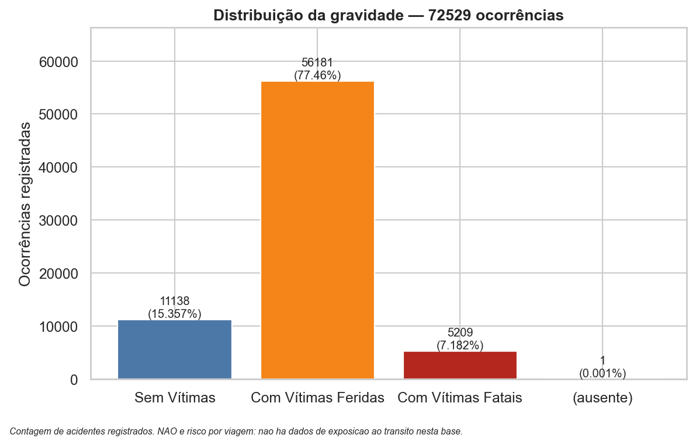

## Gravidade por faixa horária (relógio)

| faixa_horaria | Sem Vítimas | Com Vítimas Feridas | Com Vítimas Fatais | total_no_grupo | pct_Sem Vítimas | pct_Com Vítimas Feridas | pct_Com Vítimas Fatais | grupo_pequeno | pct_do_total_de_acidentes |
|---|---|---|---|---|---|---|---|---|---|
| Madrugada | 2150 | 5679 | 1078 | 8907 | 24.14 | 63.76 | 12.1 | Não | 12.28 |
| Manhã | 2700 | 17130 | 1028 | 20858 | 12.94 | 82.13 | 4.93 | Não | 28.76 |
| Tarde | 3007 | 18061 | 1234 | 22302 | 13.48 | 80.98 | 5.53 | Não | 30.75 |
| Noite | 3281 | 15311 | 1869 | 20461 | 16.04 | 74.83 | 9.13 | Não | 28.21 |

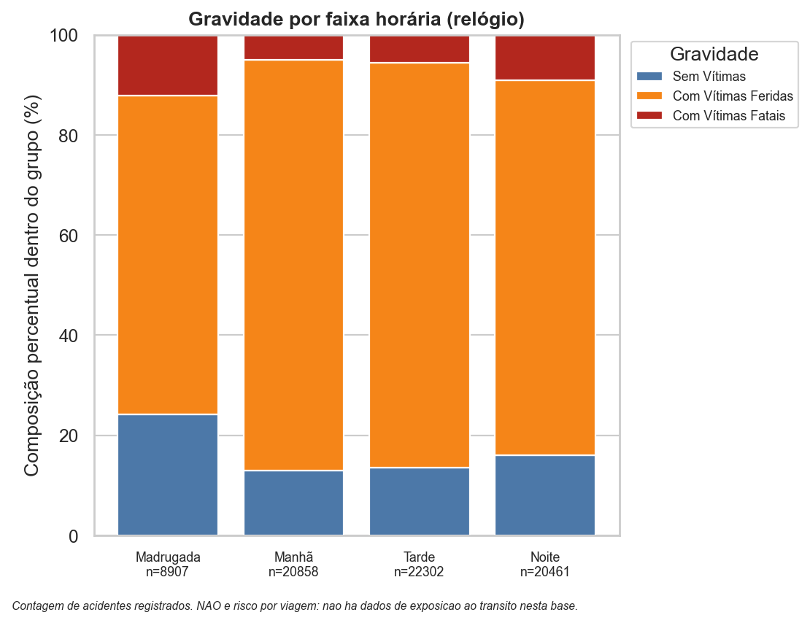

## Gravidade por condição meteorológica

| condicao_metereologica | Sem Vítimas | Com Vítimas Feridas | Com Vítimas Fatais | total_no_grupo | pct_Sem Vítimas | pct_Com Vítimas Feridas | pct_Com Vítimas Fatais | grupo_pequeno | pct_do_total_de_acidentes |
|---|---|---|---|---|---|---|---|---|---|
| (ausente) | 206 | 695 | 99 | 1000 | 20.6 | 69.5 | 9.9 | Não | 1.38 |
| Chuva | 1053 | 4983 | 402 | 6438 | 16.36 | 77.4 | 6.24 | Não | 8.88 |
| Céu Claro | 7159 | 35797 | 3418 | 46374 | 15.44 | 77.19 | 7.37 | Não | 63.94 |
| Garoa/Chuvisco | 411 | 1867 | 144 | 2422 | 16.97 | 77.09 | 5.95 | Não | 3.34 |
| Neve | 0 | 1 | 0 | 1 | 0.0 | 100.0 | 0.0 | Sim | 0.0 |
| Nevoeiro/Neblina | 106 | 387 | 60 | 553 | 19.17 | 69.98 | 10.85 | Não | 0.76 |
| Nublado | 1673 | 8932 | 830 | 11435 | 14.63 | 78.11 | 7.26 | Não | 15.77 |
| Sol | 513 | 3441 | 247 | 4201 | 12.21 | 81.91 | 5.88 | Não | 5.79 |
| Vento | 17 | 78 | 9 | 104 | 16.35 | 75.0 | 8.65 | Sim | 0.14 |

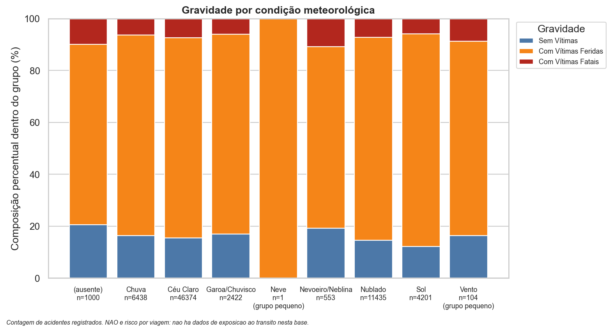

## Gravidade por tipo de pista

| tipo_pista | Sem Vítimas | Com Vítimas Feridas | Com Vítimas Fatais | total_no_grupo | pct_Sem Vítimas | pct_Com Vítimas Feridas | pct_Com Vítimas Fatais | grupo_pequeno | pct_do_total_de_acidentes |
|---|---|---|---|---|---|---|---|---|---|
| Dupla | 4918 | 24363 | 1501 | 30782 | 15.98 | 79.15 | 4.88 | Não | 42.44 |
| Múltipla | 929 | 5800 | 285 | 7014 | 13.24 | 82.69 | 4.06 | Não | 9.67 |
| Simples | 5291 | 26018 | 3423 | 34732 | 15.23 | 74.91 | 9.86 | Não | 47.89 |

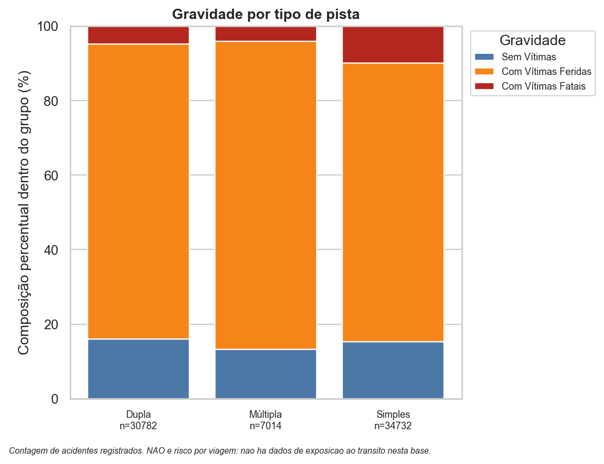

## Gravidade por uso do solo

| uso_solo | Sem Vítimas | Com Vítimas Feridas | Com Vítimas Fatais | total_no_grupo | pct_Sem Vítimas | pct_Com Vítimas Feridas | pct_Com Vítimas Fatais | grupo_pequeno | pct_do_total_de_acidentes |
|---|---|---|---|---|---|---|---|---|---|
| Rural | 6895 | 30775 | 3773 | 41443 | 16.64 | 74.26 | 9.1 | Não | 57.14 |
| Urbano | 4243 | 25406 | 1436 | 31085 | 13.65 | 81.73 | 4.62 | Não | 42.86 |

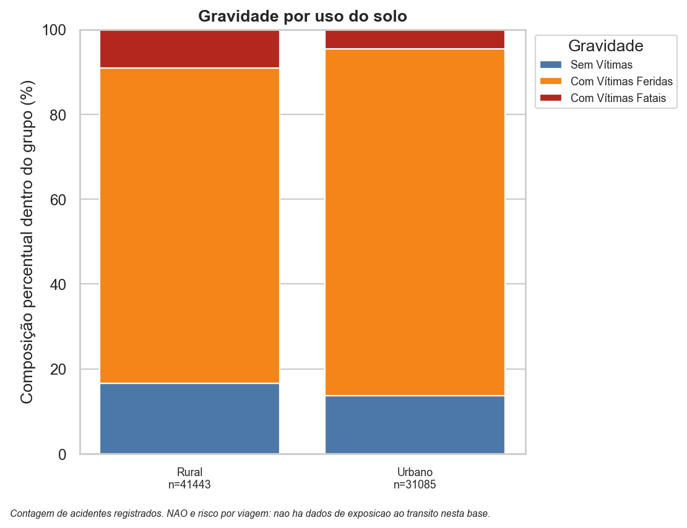

## Gravidade por fase do dia (registro da PRF)

| fase_dia | Sem Vítimas | Com Vítimas Feridas | Com Vítimas Fatais | total_no_grupo | pct_Sem Vítimas | pct_Com Vítimas Feridas | pct_Com Vítimas Fatais | grupo_pequeno | pct_do_total_de_acidentes |
|---|---|---|---|---|---|---|---|---|---|
| Amanhecer | 689 | 2372 | 386 | 3447 | 19.99 | 68.81 | 11.2 | Não | 4.75 |
| Pleno Dia | 5340 | 32986 | 2048 | 40374 | 13.23 | 81.7 | 5.07 | Não | 55.67 |
| Anoitecer | 567 | 3106 | 253 | 3926 | 14.44 | 79.11 | 6.44 | Não | 5.41 |
| Plena Noite | 4542 | 17717 | 2522 | 24781 | 18.33 | 71.49 | 10.18 | Não | 34.17 |

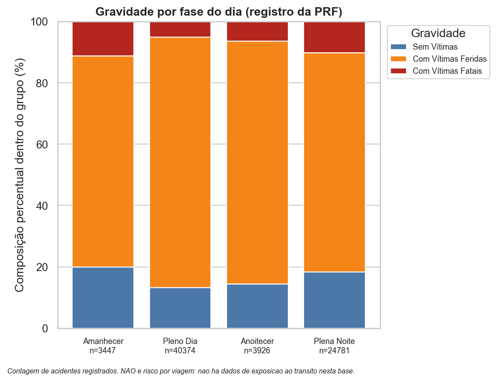

## Gravidade por dia da semana

| dia_semana | Sem Vítimas | Com Vítimas Feridas | Com Vítimas Fatais | total_no_grupo | pct_Sem Vítimas | pct_Com Vítimas Feridas | pct_Com Vítimas Fatais | grupo_pequeno | pct_do_total_de_acidentes |
|---|---|---|---|---|---|---|---|---|---|
| Segunda-feira | 1466 | 8164 | 655 | 10285 | 14.25 | 79.38 | 6.37 | Não | 14.18 |
| Terça-feira | 1221 | 7255 | 586 | 9062 | 13.47 | 80.06 | 6.47 | Não | 12.49 |
| Quarta-feira | 1292 | 7656 | 607 | 9555 | 13.52 | 80.13 | 6.35 | Não | 13.17 |
| Quinta-feira | 1363 | 7417 | 625 | 9405 | 14.49 | 78.86 | 6.65 | Não | 12.97 |
| Sexta-feira | 1606 | 8825 | 766 | 11197 | 14.34 | 78.82 | 6.84 | Não | 15.44 |
| Sábado | 2039 | 8562 | 953 | 11554 | 17.65 | 74.1 | 8.25 | Não | 15.93 |
| Domingo | 2151 | 8302 | 1017 | 11470 | 18.75 | 72.38 | 8.87 | Não | 15.81 |

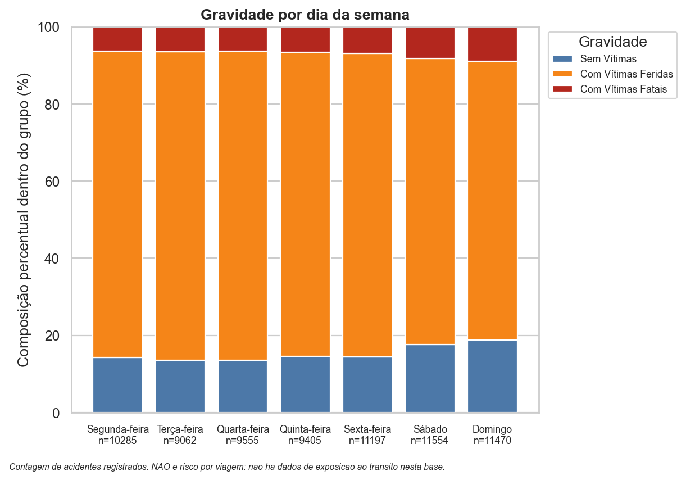

## Gravidade em fim de semana

| fim_de_semana | Sem Vítimas | Com Vítimas Feridas | Com Vítimas Fatais | total_no_grupo | pct_Sem Vítimas | pct_Com Vítimas Feridas | pct_Com Vítimas Fatais | grupo_pequeno | pct_do_total_de_acidentes |
|---|---|---|---|---|---|---|---|---|---|
| Não | 6948 | 39317 | 3239 | 49504 | 14.04 | 79.42 | 6.54 | Não | 68.26 |
| Sim | 4190 | 16864 | 1970 | 23024 | 18.2 | 73.25 | 8.56 | Não | 31.74 |

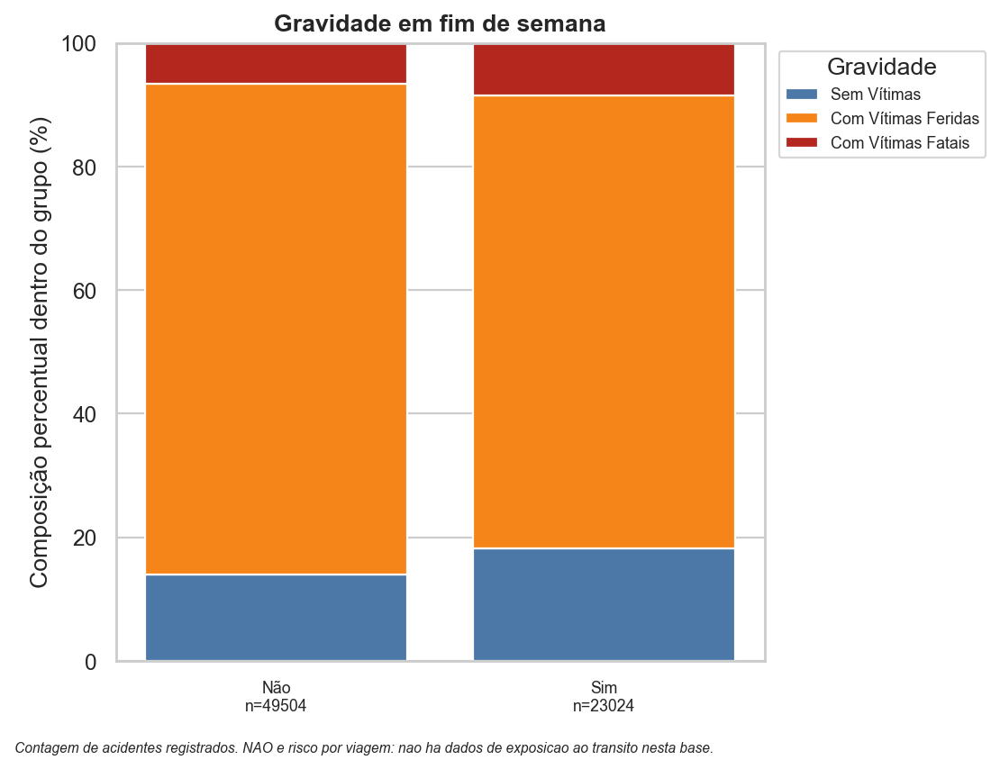

## Variantes de visual para os slides

Os graficos acima sao a referencia principal (barras e barras 100% empilhadas). As figuras abaixo sao **variacoes de estilo** com os mesmos numeros, pensadas para o projetor:

| arquivo | quando usar |
|---|---|
| `09_pizza_gravidade.png` | mostrar o desbalanceamento das classes |
| `10_rosca_gravidade.png` | mesma pizza, com o total no centro |
| `11_barras_horizontais_dia_semana.png` | volume por dia da semana |
| `12_barras_horizontais_faixa_horaria.png` | volume por faixa horaria |
| `13_barras_horizontais_clima.png` | volume por clima (grupos pequenos omitidos) |
| `14_barras_agrupadas_tipo_pista.png` | volume absoluto (nao percentual) por tipo de pista |
| `15_heatmap_faixa_horaria.png` / `16_heatmap_dia_semana.png` | comparar % de cada gravidade em uma tabela visual |
| `17_pizzas_uso_solo.png` / `18_pizzas_fim_de_semana.png` / `19_pizzas_tipo_pista.png` | comparar composicao entre poucas categorias |

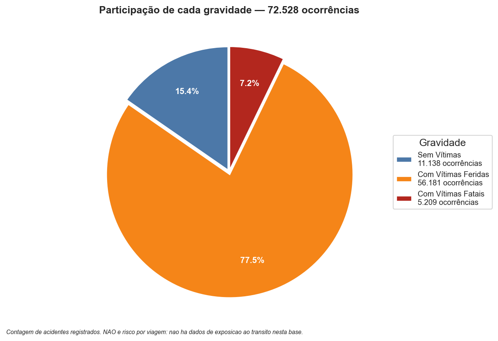

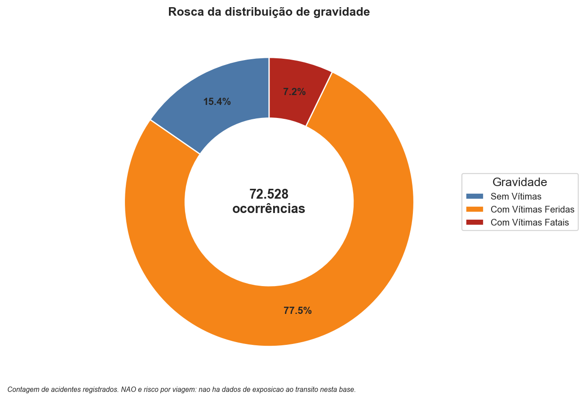

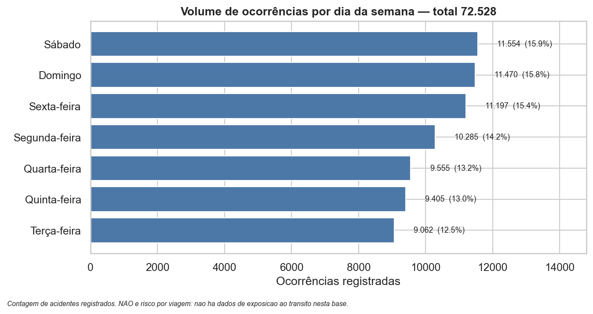

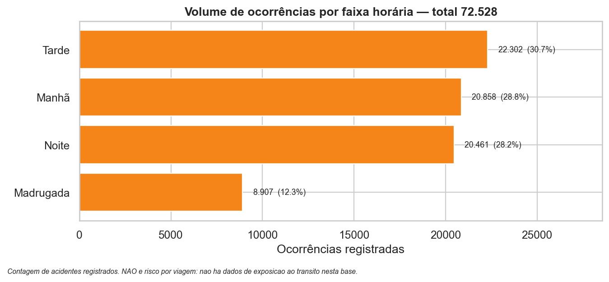

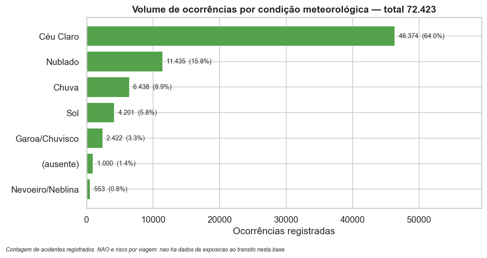

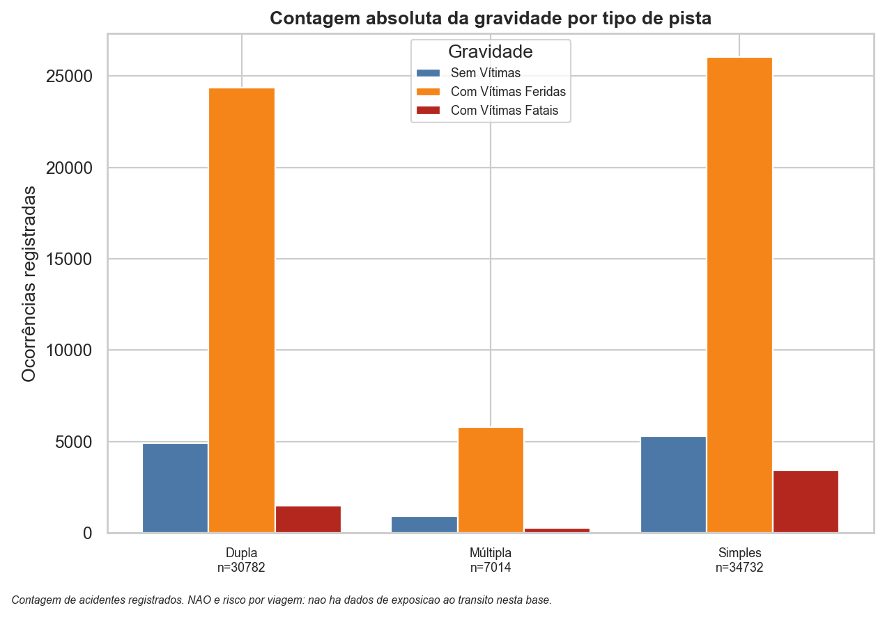

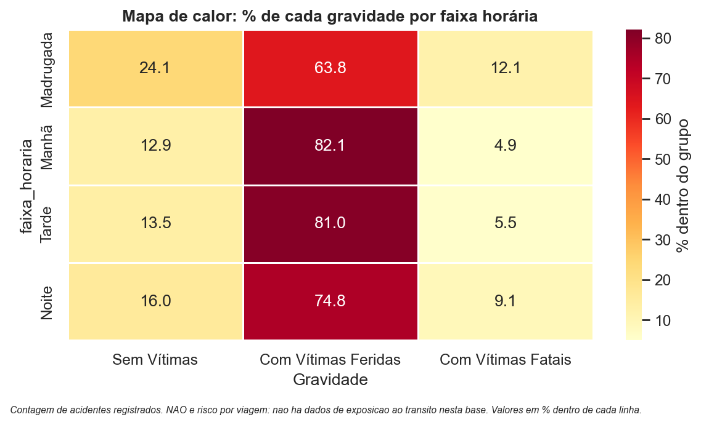

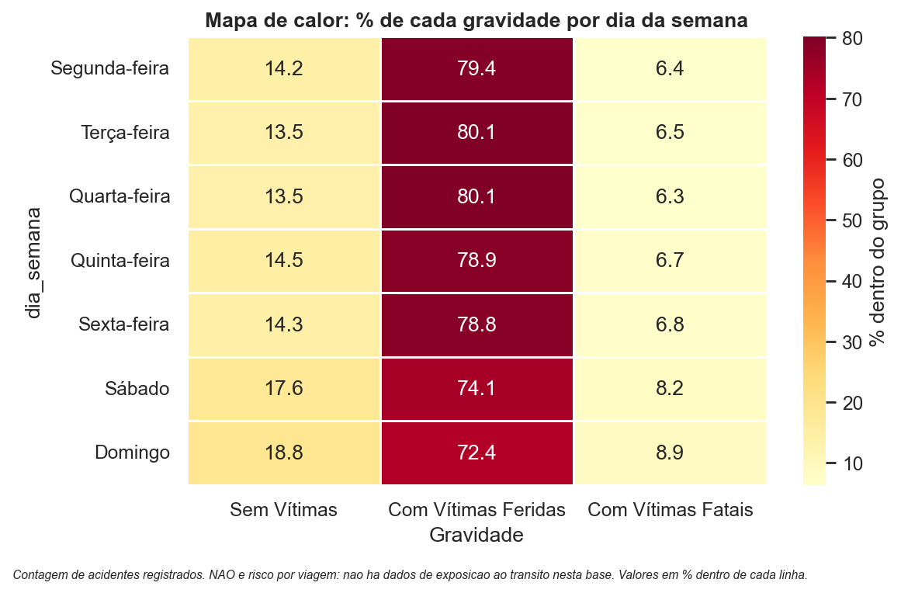

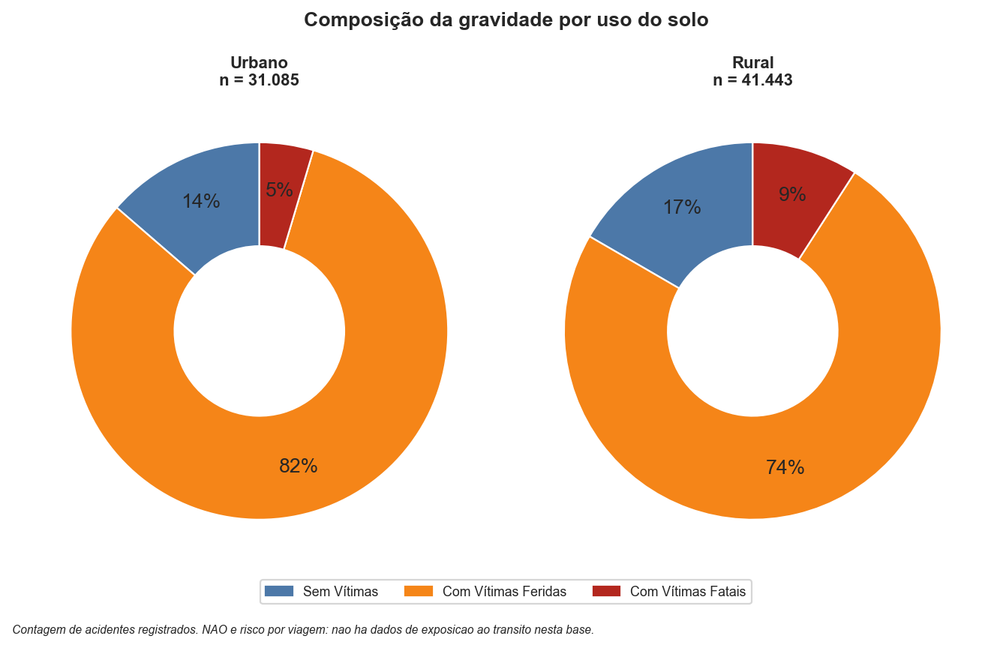

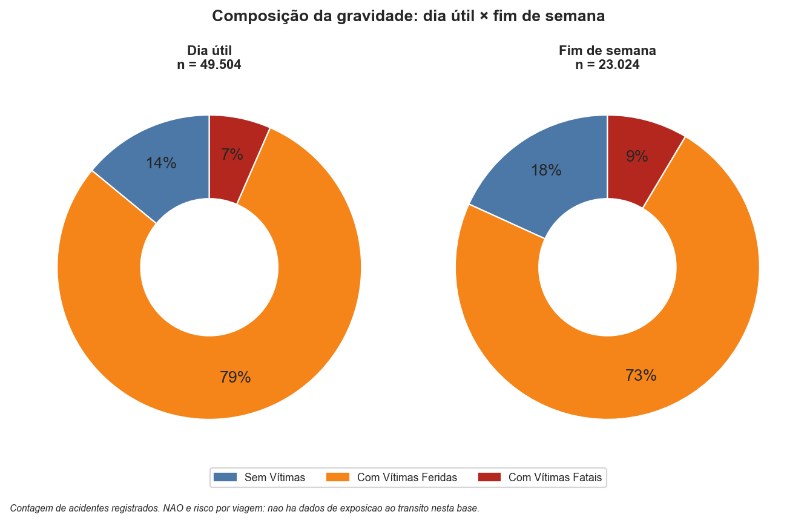

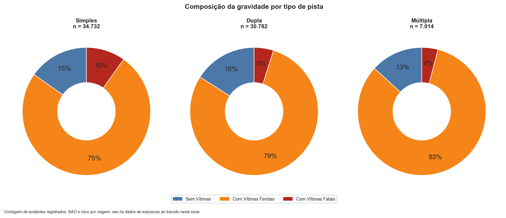

## Como ler estes numeros

- `total_no_grupo` e o denominador: o percentual de cada classe e calculado DENTRO do grupo.
- `grupo_pequeno = Sim` significa que o percentual vem de poucos casos e pode variar muito; nao serve para conclusao.
- Diferenca de composicao entre grupos e ASSOCIACAO observada nos registros, nao causa nem probabilidade de acidente por viagem.
- Grupos com `(ausente)` mostram quanta informacao faltava, em vez de esconder a ausencia.

## Limitacoes

- A validacao confere conformidade com estas regras explicitas; nao confere se o registro policial descreve corretamente o mundo real.
- Ausencia de nulos nao significa base correta.
- Frequencias de acidentes nao medem risco por viagem, pois nao ha dados de exposicao ao transito.
- A base limpa cobre apenas o periodo do arquivo fornecido.