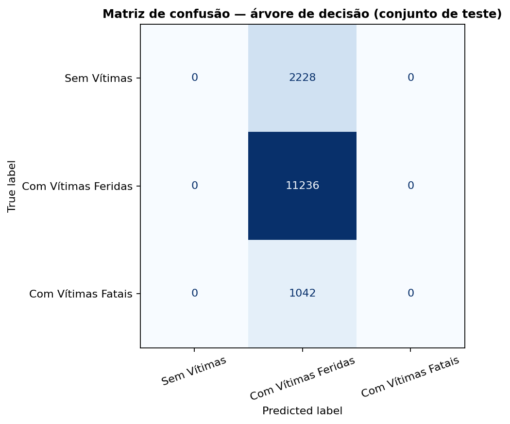
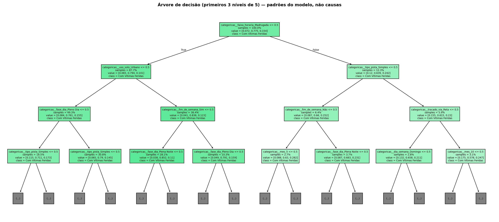

# Mineracao (complemento de estudo): arvore de decisao

> Este resultado e complemento computacional. O trabalho avaliado pede o PLANEJAMENTO do KDD; nada nos slides depende deste treino.

- Base: `C:\Users\Administrator\Desktop\Ciencia de dados\data\processed\prf_limpo.csv`
- SHA-256 da base: `0a028fe02ec748e115ab5e4d0d4d3cda3b6ae034a5b26deaebc69d267fa3d4ed`
- Status da validacao antes do treino: **APROVADA_COM_RESSALVAS**
- Execucao: 2026-09-12T14:39:07-03:00
- Versoes: Python 3.12.6, pandas 2.2.3, scikit-learn 1.6.1

## Configuracao

- Entradas permitidas (lista explicita do contrato): ['dia_semana', 'faixa_horaria', 'fim_de_semana', 'mes', 'fase_dia', 'condicao_metereologica', 'tipo_pista', 'tracado_via', 'uso_solo']
- Alvo: `classificacao_acidente`
- Divisao: 80/20 estratificada, feita antes de qualquer transformacao aprendida
- Pipeline ajustado: somente no conjunto de treino
- random_state: 42
- class_weight: None
- min_samples_leaf: 50
- Profundidades testadas por validacao cruzada no treino: [3, 4, 5, 6, 8, 10]
- max_depth escolhido: **5** (macro-F1 na CV do treino = 0.2915)

## Dados usados

- Ocorrencias na base limpa: 72529
- Excluidas do treino por alvo ausente: 1
- Elegiveis: 72528 (treino 58022 / teste 14506)
- Suporte por classe no treino: {'Com Vítimas Feridas': 44945, 'Sem Vítimas': 8910, 'Com Vítimas Fatais': 4167}
- Suporte por classe no teste: {'Com Vítimas Feridas': 11236, 'Sem Vítimas': 2228, 'Com Vítimas Fatais': 1042}
- Classes com suporte abaixo do minimo: nenhuma
- Ocorrencias presentes no treino E no teste: 0 (precisa ser zero)

## Arvore x referencia

| modelo | acuracia_global | acuracia_balanceada | macro_f1 |
|---|---|---|---|
| Arvore de decisao | 0.7746 | 0.3333 | 0.291 |
| DummyClassifier (most_frequent) | 0.7746 | 0.3333 | 0.291 |

- A arvore superou a referencia em macro-F1? **False**
- Em acuracia balanceada? **False**
- Em acuracia global? **False**

## Metricas por classe

| modelo | classe | precisao | recall | f1 | suporte |
|---|---|---|---|---|---|
| Arvore de decisao | Sem Vítimas | 0.0 | 0.0 | 0.0 | 2228 |
| Arvore de decisao | Com Vítimas Feridas | 0.7746 | 1.0 | 0.873 | 11236 |
| Arvore de decisao | Com Vítimas Fatais | 0.0 | 0.0 | 0.0 | 1042 |
| DummyClassifier (most_frequent) | Sem Vítimas | 0.0 | 0.0 | 0.0 | 2228 |
| DummyClassifier (most_frequent) | Com Vítimas Feridas | 0.7746 | 1.0 | 0.873 | 11236 |
| DummyClassifier (most_frequent) | Com Vítimas Fatais | 0.0 | 0.0 | 0.0 | 1042 |

## Matriz de confusao (arvore)

Ordem das classes: ['Sem Vítimas', 'Com Vítimas Feridas', 'Com Vítimas Fatais']

```
[0, 2228, 0]
[0, 11236, 0]
[0, 1042, 0]
```



## Arvore aprendida



As regras completas em texto estao em `arvore_regras.txt`. Elas descrevem o comportamento do MODELO, nao causas de acidente.

## Atributos mais usados pela arvore

| atributo | importancia |
|---|---|
| categoricas__faixa_horaria_Madrugada | 0.3933364090612369 |
| categoricas__uso_solo_Urbano | 0.1811855803323756 |
| categoricas__fase_dia_Pleno Dia | 0.13190029907069306 |
| categoricas__tipo_pista_Simples | 0.10768492326692028 |
| categoricas__fim_de_semana_Sim | 0.06099287549864697 |
| categoricas__fase_dia_Plena Noite | 0.02558163747377665 |
| categoricas__tracado_via_Reta | 0.022382587594430275 |
| categoricas__fim_de_semana_Não | 0.018201503261883526 |
| categoricas__dia_semana_Domingo | 0.009841735223848293 |
| categoricas__mes_4 | 0.008342360670369664 |
| categoricas__fase_dia_Amanhecer | 0.008064753740696613 |
| categoricas__tracado_via_Curva | 0.0071654372929168125 |
| categoricas__mes_2 | 0.004733056841472558 |
| categoricas__tipo_pista_Dupla | 0.004700410482595038 |
| categoricas__mes_10 | 0.004425107090170096 |
| categoricas__mes_5 | 0.0036300236830798974 |
| categoricas__mes_7 | 0.003531929823880723 |
| categoricas__mes_9 | 0.0027006975940762723 |
| categoricas__uso_solo_Rural | 0.001598671996930713 |

> Importancia alta significa que o atributo foi util para separar as classes NESTE modelo. Nao significa que ele cause acidentes graves.

## Padronizacao de formato x normalizacao de escala

- A limpeza padronizou FORMATOS: data `aaaa-mm-dd`, hora `HH:MM:SS`, UF em maiusculas, categorias com grafia unica.
- NORMALIZAR escala (media 0, desvio 1) e outra operacao, usada por modelos que comparam magnitudes entre colunas. Arvore de decisao nao precisa: ela testa um limiar por atributo, de cada vez.

## Advertencias

- Estudo retrospectivo: avalia acidentes JA REGISTRADOS. Nao e previsao de periodos futuros.
- Regras da arvore sao padroes do modelo, nao relacoes causais.
- As probabilidades da arvore nao sao risco calibrado, ainda mais com class_weight='balanced'.
- Acuracia global e complementar: com 77% de uma classe, um chute fixo ja acerta muito.
- Nenhum parametro foi escolhido olhando o conjunto de teste.

## Limitacoes

- A validacao confere conformidade com estas regras explicitas; nao confere se o registro policial descreve corretamente o mundo real.
- Ausencia de nulos nao significa base correta.
- Frequencias de acidentes nao medem risco por viagem, pois nao ha dados de exposicao ao transito.
- A base limpa cobre apenas o periodo do arquivo fornecido.